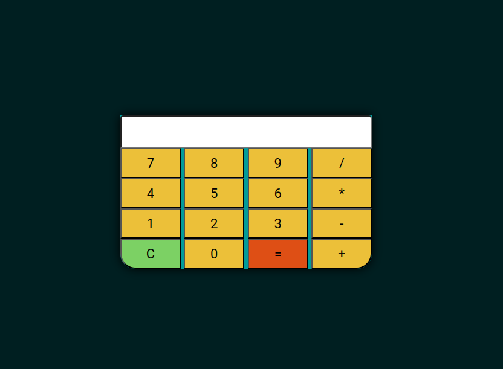

<h1 align="center">Calculadora JavaScript</h1>
<h1 align="center"></h1>

### 📚 Sobre
 

  
Calculadora feita para fixação de conteúdo JavaScript para o curso de "Lógica com Javascript" do Projeto Aranouá, oferecido pela SAMSUNG.

### 🎨 Detalhe

Foi utilizado diversos componentes tanto de estilização quanto de mecânica no JavaScript.

### 💻 Tecnologias utilizadas

Nesta Calculadora Javascript foram utilizadas as seguintes tecnologias

- [HTML](https://www.w3schools.com/html/)
- [CSS](https://www.w3schools.com/css/)
- [JavaScript](https://www.w3schools.com/js/)

### Contato

E-mail: [ademar.castro@icomp.ufam.edu.br](mailto:ademar.castro@icomp.ufam.edu.br)  
Linkedin: [https://www.linkedin.com/in/ademar-castro-8bb95b256/](https://www.linkedin.com/in/ademar-castro-8bb95b256/)  
Instagram: [instagram.com/ademar_castroo](instagram.com/ademar_castroo)